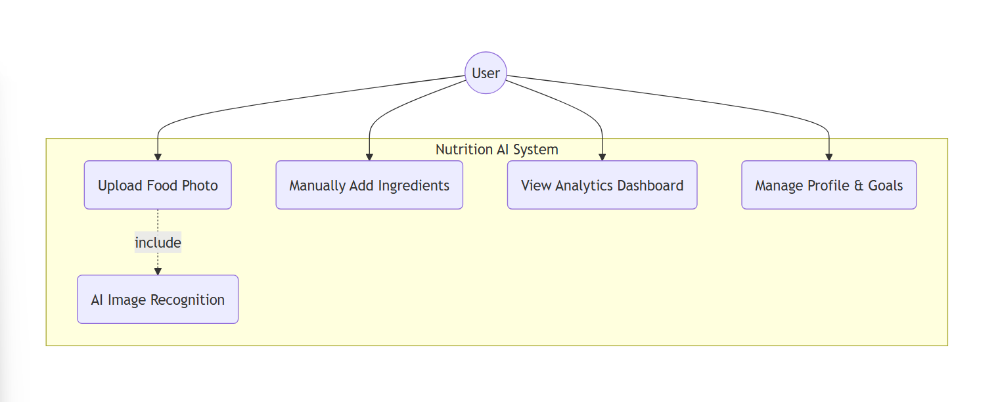
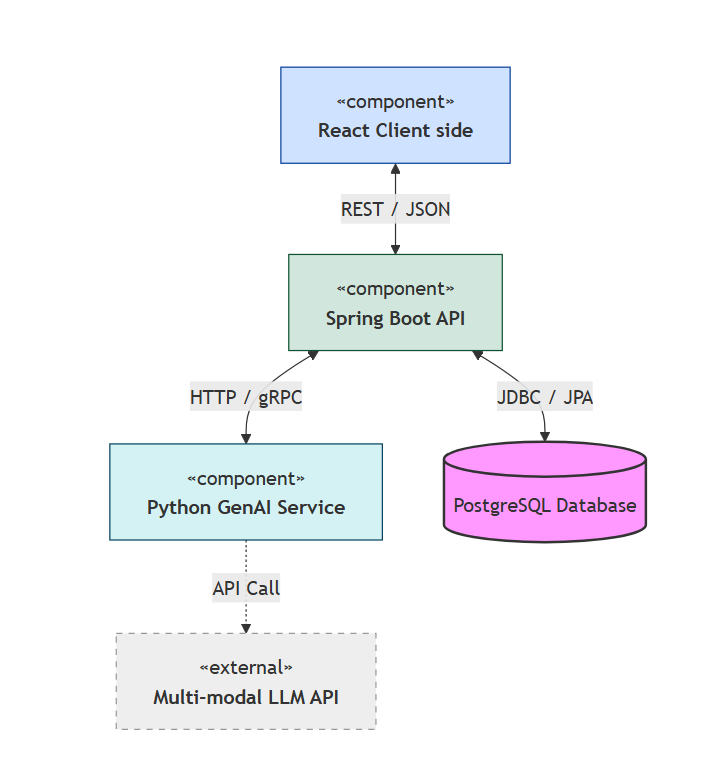
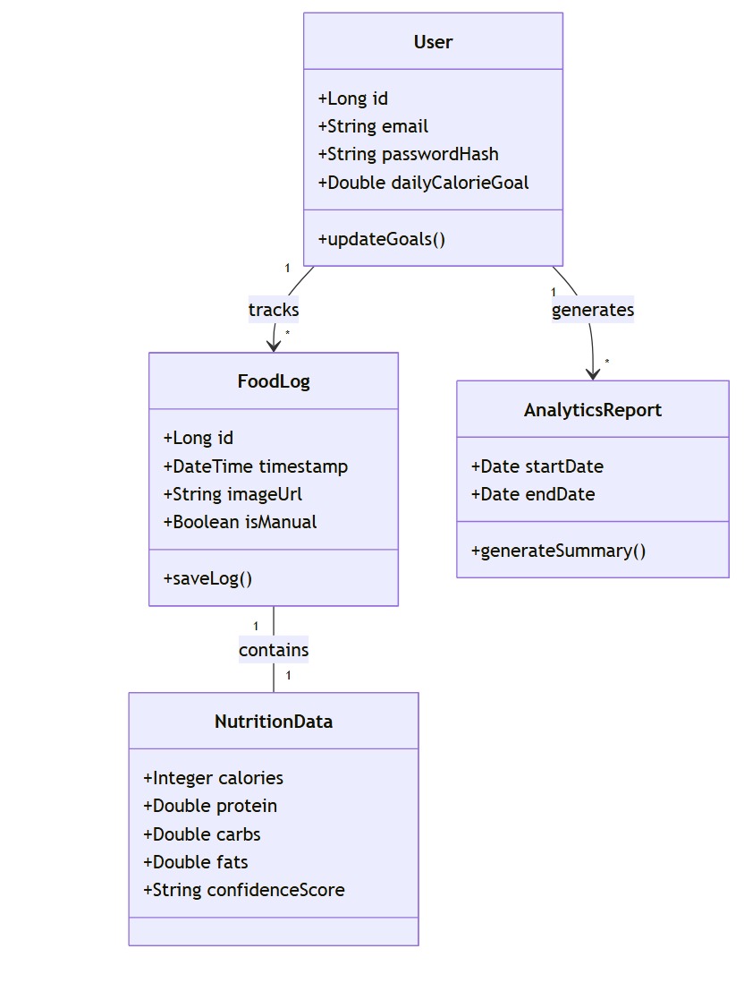

# Initial System Structure

### Client: React
A responsive mobile app that handles photo uploads, manual data entry, and renders the analytics dashboard using libraries like Recharts or Chart.js.

### Server: Spring Boot REST API 
The central orchestrator. It manages user authentication (JWT), handles CRUD operations for user profiles and historical logs, and communicates with the GenAI
microservice.

### GenAI Service: Python & LangChain 

A dedicated Python microservice is the best choice here. Python is the industry standard for AI/ML. LangChain will be used to orchestrate the "Reasoning" process: taking a photo, sending it to a multi-modal model (like GPT-4o or Gemini 1.5 Pro), and parsing the unstructured output into a structured JSON format (calories, protein, carbs, fats).

### Database: PostgreSQL
A relational database is ideal for this structured data. It will store user profiles, food log history with nutritional breakdowns, and daily/weekly goals.

## 2. Backlog

Check out our [Miro Backlog](https://miro.com/app/board/uXjVHdWuFjk=/) for the latest tasks.

## 2. UML Diagrams

## Use Case Diagram

## Top-Level Architecture Diagram

## Class Diagram

