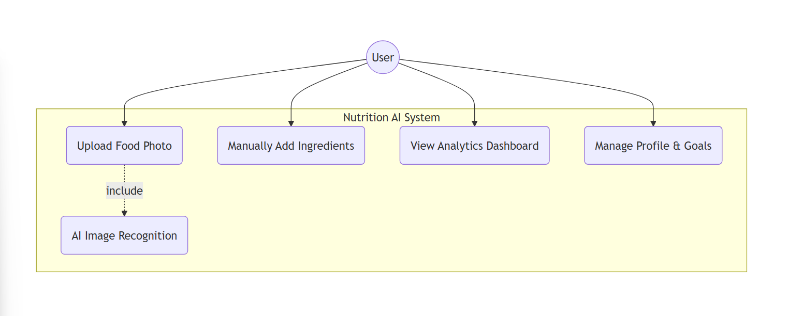
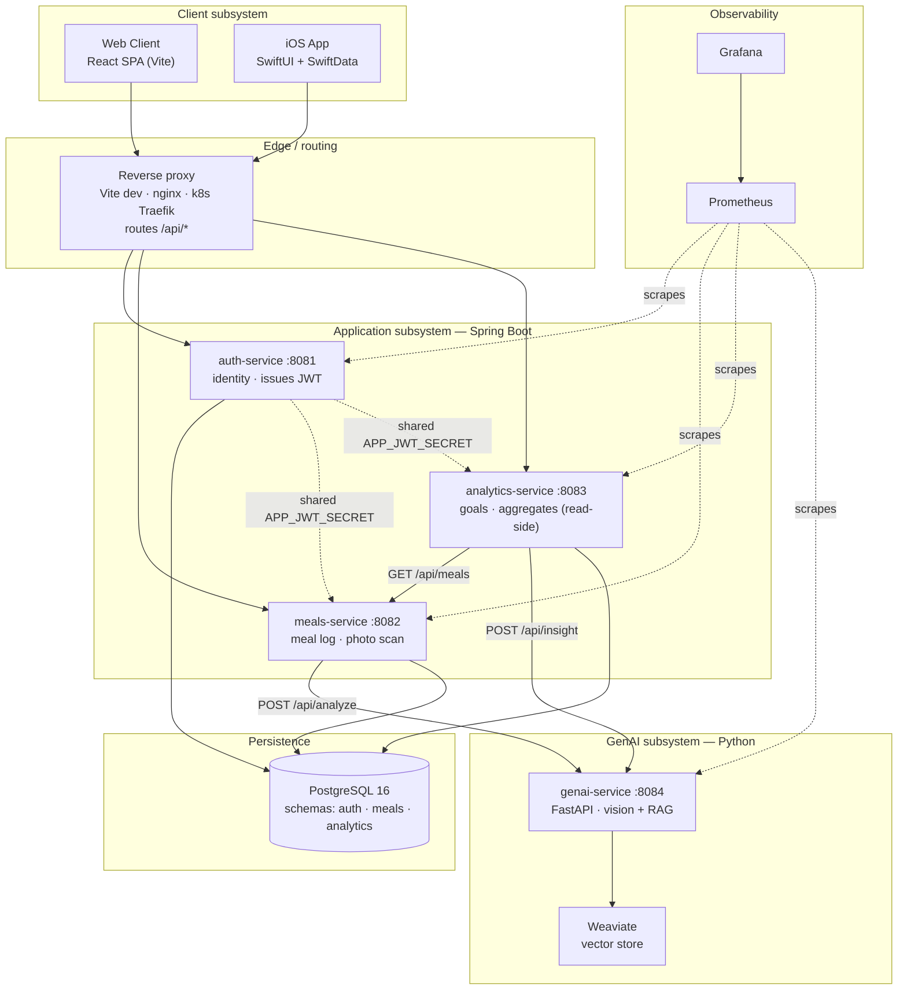
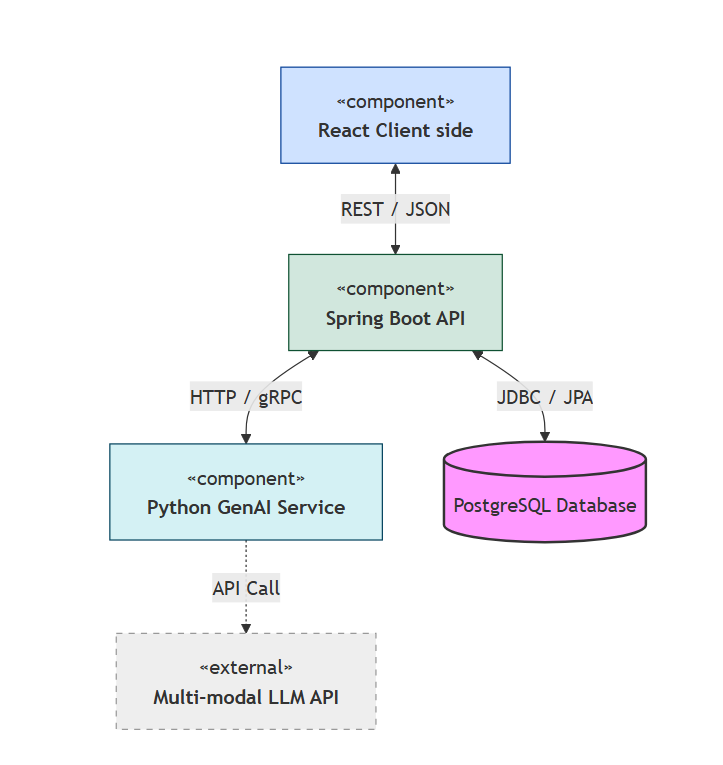
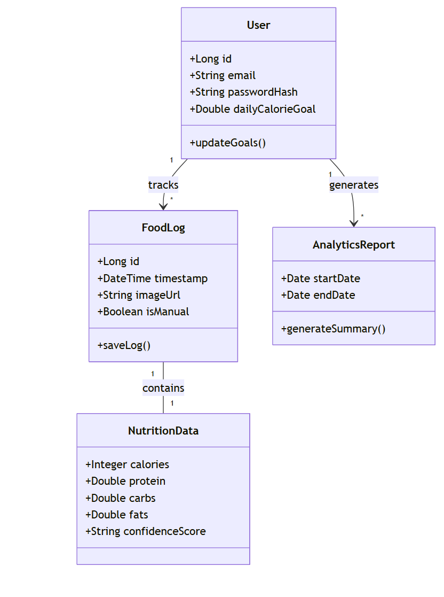

# System Architecture

## Overview

Calorieasy is a nutrition tracking platform that uses GenAI to reduce the friction of food logging — users can snap a photo of a meal and receive calorie and macro estimates in seconds. The system is composed of four backend microservices, a React web client, and an iOS prototype.

## UML Diagrams

### Use Case Diagram


### Subsystem Decomposition

The system decomposes into six subsystems (packages) and their runtime dependencies.
This diagram reflects the **current** implementation — the three separate Spring
services, the GenAI subsystem with its vector store, and the observability stack.



### Component / Architecture Diagram


> Note: `sys-architecture.png` predates the split into three Spring services and
> still shows a single "Spring Boot API" box. Use the **Subsystem Decomposition**
> above for the current service boundaries.

### Class Diagram



## Architecture Overview (current implementation)

```
┌──────────────────────┐     ┌──────────────────────┐
│   React Web Client   │     │   iOS SwiftUI App     │
│  (Vite + TypeScript) │     │  (SwiftData + sync) │
└────────┬─────────────┘     └──────────────────────┘
         │  JWT  (all API calls)
         ▼
┌──────────────────────────────────────────────────────────────┐
│                        NGINX / Traefik                        │
│                  (reverse proxy / ingress)                    │
└───────┬──────────────────┬────────────────┬──────────────────┘
        │                  │                │
        ▼                  ▼                ▼
┌───────────────┐  ┌──────────────┐  ┌─────────────────────┐
│  auth-service │  │meals-service │  │  analytics-service  │
│  Spring Boot  │  │ Spring Boot  │  │    Spring Boot      │
│   port 8081   │  │  port 8082   │  │     port 8083       │
│               │  │      │       │  │         │           │
│  Issues JWT   │  │      │       │  │  Calls meals-svc    │
│  Stores users │  │      ▼       │  │  (bearer fwd)       │
└──────┬────────┘  │ genai-service│  └──────────┬──────────┘
       │           │  FastAPI     │             │
       │           │  port 8084   │             │
       │           │              │             │
       │           │  Gemini +    │             │
       │           │  Nemotron    │             │
       │           └──────┬───────┘             │
       │                  │                     │
       └──────────────────┴─────────────────────┘
                          │
                          ▼
              ┌────────────────────┐
              │    PostgreSQL 16   │
              │  schema: auth      │
              │  schema: meals     │
              │  schema: analytics │
              └────────────────────┘
```

## Services

### auth-service (port 8081)
Handles user registration, login, and JWT issuance. Uses a shared JWT secret so the other services can verify tokens locally without a round-trip to auth. Stores users and profile fields (body metrics, activity, goal kind) in the `auth` schema. Nutrition targets (calories/macros) live in `analytics-service`.

**Key endpoints:** `POST /api/auth/register`, `POST /api/auth/login`, `GET /api/users/me`, `PUT /api/users/me`

### meals-service (port 8082)
Manages meal logs. Accepts manual meal entries and photo uploads. When a photo is submitted, the service forwards it to genai-service and stores the result. Uses the `meals` schema.

**Key endpoints:** `GET/POST /api/meals`, `POST /api/meals/analyze` (photo → GenAI), `POST /api/meals/estimate`

### analytics-service (port 8083)
Provides daily and weekly nutrition summaries, goal progress, streak calculations, and RAG health insights. Calls meals-service internally (with bearer token forwarding) to aggregate meal data; calls genai-service for `/api/insight`. Uses the `analytics` schema.

**Key endpoints:** `GET /api/analytics/daily`, `GET /api/analytics/weekly`, `GET /api/analytics/insight`, `GET /api/goals`, `PUT /api/goals`

### genai-service (port 8084)
Python FastAPI microservice that powers photo-based meal analysis, food-name estimation, and RAG health insights. It accepts an image or food name, sends it to a configurable vision/text LLM, parses the structured response, and resolves nutritional data from the USDA FDC API (with a local fallback cache). Returns calories, protein, carbs, fat, fiber, and a confidence score.

**Supported LLM providers:** Google Gemini (primary vision), OpenRouter Nemotron (backup vision), AET Logos gpt-oss-120b (text estimate + RAG)  
**Key endpoints:** `POST /api/analyze`, `POST /api/analyze/base64`, `POST /api/estimate`, `POST /api/insight`

## Database

A single PostgreSQL 16 instance with three schemas for schema-level isolation. Each service manages its own schema using Flyway migrations that run automatically on startup. There is no cross-schema foreign key dependency — services communicate only via REST.

## Authentication

JWT with a shared HMAC secret (`APP_JWT_SECRET`). auth-service signs tokens; meals-service and analytics-service verify them locally using Spring Security. Token expiry is configured per environment.

## Frontend — React Web Client

Built with Vite + TypeScript using Feature-Sliced Design (FSD):

```
src/
├── app/        Shell, routing, global styles
├── pages/      Route-level compositions (home, diary, insights, profile)
├── features/   User interactions (auth, scan-meal, manual-entry, onboarding)
├── entities/   Domain models + API (meal, nutrition, user)
├── widgets/    Composite UI (sidebar, tabbar, toast)
└── shared/     API client, config flags, reusable UI primitives
```

State is managed via Zustand stores. Playwright e2e tests mock API responses so frontend flows can run without a live backend.

## iOS App

SwiftUI client using SwiftData as an offline cache with backend sync (`SyncService`) for auth, meals, goals, and GenAI photo analysis. Water tracking and the home-screen widget remain local-only. Generated via xcodegen (`project.yml`).

## Deployment

| Target | Tooling |
|--------|---------|
| Local dev | `docker compose up` (all 5 services + Vite dev server) |
| AET Kubernetes | Helm chart → GitHub Actions (`deploy-aet.yml`) |
| Azure VM | Terraform (provision) + Ansible (deploy) → GitHub Actions (`deploy-azure.yml`, manual) |

CI/CD is handled by GitHub Actions. Every push to `main` and every PR triggers the full CI pipeline (Java build + JUnit, Vitest, Playwright e2e, genai pytest). On a successful build of `main`, Docker images are built and pushed to GHCR with immutable SHA tags, then deployed via Helm to the AET K8s cluster.

## Backlog

See [`docs/sprint-plan.md`](sprint-plan.md) for the sprint history and upcoming work.
