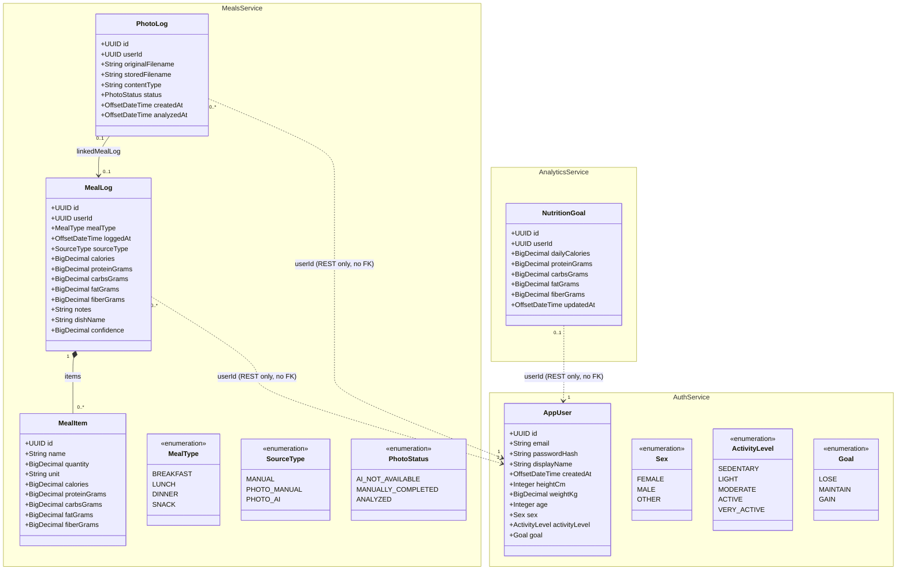

# Analysis Object Model

The persisted domain entities, exactly as implemented (JPA `@Entity` classes, one Postgres schema
per service). All IDs are UUIDs. There are **no cross-schema foreign keys** — services reference a
user only by the `userId` UUID from the JWT and communicate over REST.

Notes on intentional absences:

- **No `AnalyticsReport` entity** — daily/weekly/range aggregates, streak, and the RAG insight are
  computed on request by analytics-service from meals-service data; only `NutritionGoal` is
  persisted (one row per user, `userId` unique).
- **No `NutritionData` entity** — macros are inlined on `MealLog`/`MealItem` as `BigDecimal` columns.
- **Photo bytes are not in the database** — `PhotoLog` stores metadata; images live on a filesystem
  volume and are served via `GET /api/meals/photo/:id/raw`.
- genai-service persists nothing relational (Weaviate vector store + static `nutrition_db.json`).

## iOS mirror (SwiftData)

| Backend entity | iOS `@Model` |
|----------------|--------------|
| `AppUser` + `NutritionGoal` | `UserProfile` — one local record, synced via `PUT /api/users/me` + `PUT /api/goals` |
| `MealLog` | `FoodLog` — adds `serverId` + `dirty` flag for offline-first sync |
| `MealItem` | `Ingredient` |
| `PhotoLog` | none — `imageData` inlined on `FoodLog` (`.externalStorage`) |
| — | `WaterLog` — iOS-only, never synced (no backend endpoint) |
| — | `MealTombstone` — iOS-only sync bookkeeping: records offline deletions until pushed |

See [`ios-app/README.md`](../ios-app/README.md) for the sync design.

> The original design-phase sketch is preserved as [`OLD_object-diagram.png`](OLD_object-diagram.png)
> to show how the domain model evolved during the project.
