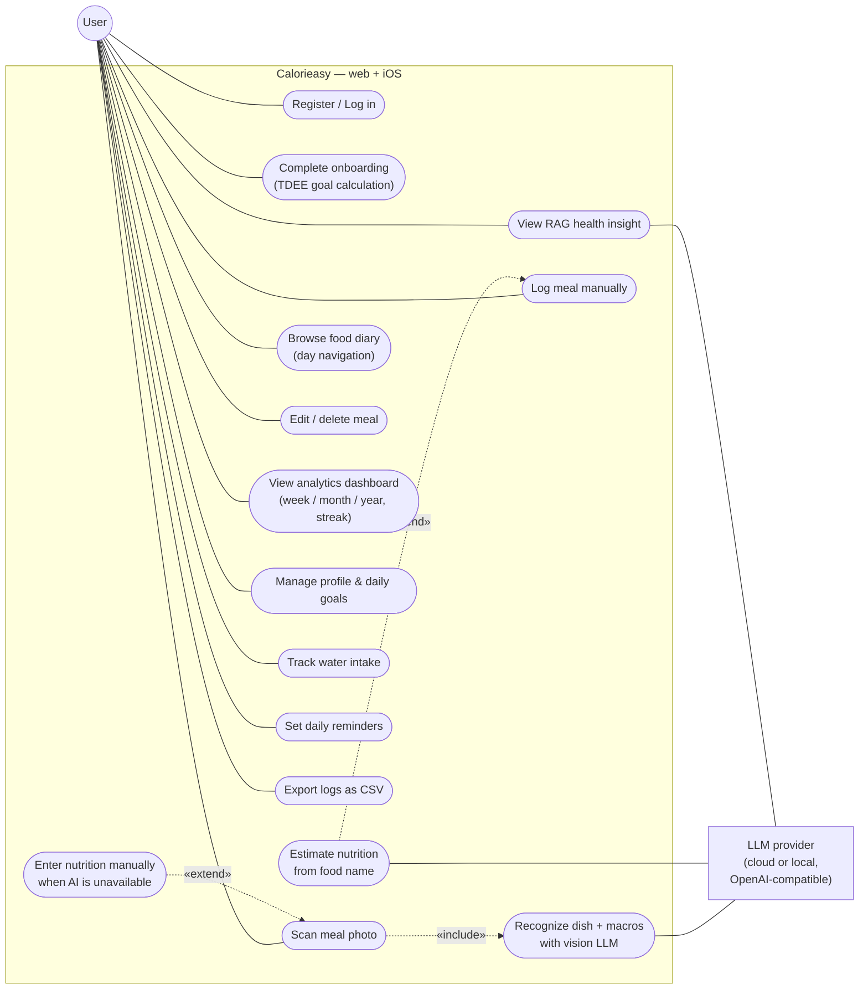

# Use Case Diagram

Calorieasy's user-facing functionality, as implemented in the web client (`calorie-app/`) and the
iOS app (`ios-app/`). Every use case below maps to shipped code — see the table under the diagram.

## Use case → implementation

| Use case | Implementation |
|----------|----------------|
| Register / Log in | `POST /api/auth/register`, `POST /api/auth/login` — web `features/auth`, iOS `Views/Auth` + Keychain |
| Complete onboarding | web `features/onboarding` (Mifflin–St Jeor in `entities/user/model/profile.ts`), iOS `Views/Onboarding` + `GoalCalculator` |
| Scan meal photo | `POST /api/meals/analyze` → genai `/api/analyze` — web `features/scan-meal`, iOS `Views/Log` |
| — Recognize dish with vision LLM «include» | genai-service `nutrition_analyzer.py` (Gemini primary, Nemotron backup) |
| — Enter nutrition manually «extend» | `POST /api/meals/photo` + `POST /api/meals/photo/:id/convert-manual` (fallback when GenAI unavailable) |
| Log meal manually | `POST /api/meals/manual` — web `features/manual-entry`, iOS `MealEditorView` |
| — Estimate nutrition from food name «extend» | `POST /api/meals/estimate` → genai text LLM |
| Browse food diary | `GET /api/meals?from&to` — web `pages/diary`, iOS `Views/History` |
| Edit / delete meal | `PUT /api/meals/:id`, `DELETE /api/meals/:id` — web `features/meal-detail`, iOS swipe-to-delete + editor |
| View analytics dashboard | web: `GET /api/analytics/daily·weekly` (`pages/home`), `GET /api/analytics/range` + `streak` (`pages/insights`); iOS `Views/Analytics` aggregates local SwiftData (streak synced); also surfaced by the iOS home-screen widget (`NutritionAppWidget`) |
| View RAG health insight | `GET /api/analytics/insight` → genai `/api/insight` (Weaviate-grounded) — web `features/health-insight` (web-only today) |
| Manage profile & daily goals | `PUT /api/goals` — web `pages/profile`, iOS `Views/Profile`; `PUT /api/users/me` — web `features/onboarding` (save step), iOS profile sync (the web profile page edits goals only) |
| Track water intake | web: local state on home page; iOS: `WaterLog` (SwiftData, local-only) |
| Set daily reminders | iOS: local notifications with time picker (`Services/NotificationsManager`); web: toggle only, no notifications |
| Export logs as CSV | iOS `Services/CSVExporter` + share sheet (iOS-only) |

> The original design-phase sketch is preserved as [`OLD_usecase-diagram.png`](OLD_usecase-diagram.png)
> to show how the scope evolved during the project.
